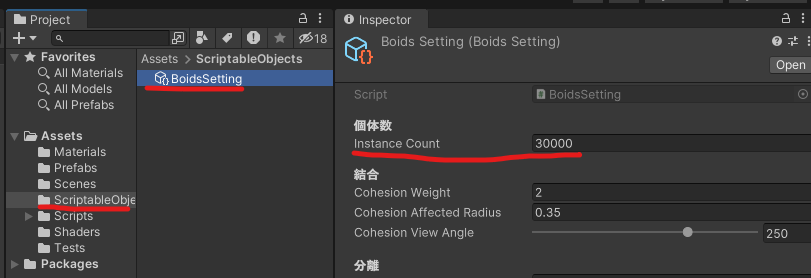
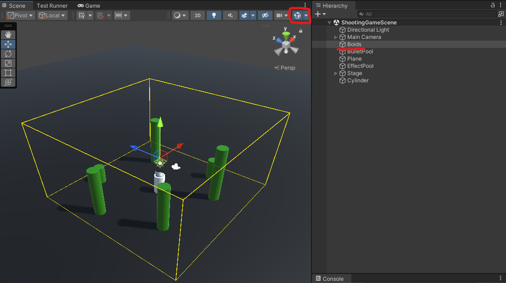
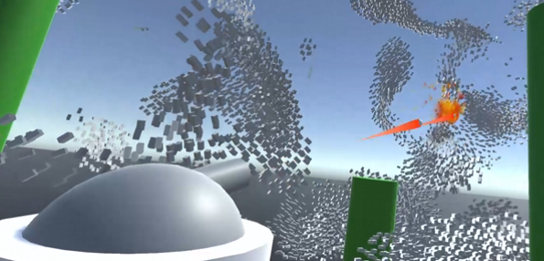

## このリポジトリについて

こちらは[「Aiming Tech Book Vol.4 1章 JobSystemによる3Dシューティングゲーム」](https://techbookfest.org/product/8gcC1JY6PPQZ5h77XNAeu)のサンプルプロジェクトです。
前作[「Aiming Tech Book Vol.3 1章 Collider を避ける魚群シミュレーション」](https://aiming.booth.pm/items/4786488)のプロジェクトを元に、シューティングゲームに拡張したゲームになっています。

### 関連

Collider を避ける魚群シミュレーション サンプルリポジトリ : https://github.com/Shitakami/BoidsSimulation_ColliderAvoidance  
※バージョンが低いので現バージョンと異なる部分があります。

### サンプルプロジェクトの環境

* Unity2022.3.16f
* Bult-in
* Unity Package
    * Burst 1.8.15
    * Collections 2.1.4
    * Mathematics 1.2.6

### プレイ動画

https://github.com/Shitakami/3DJobSystemShootingGame-Techbook14/assets/31841026/e988ffc0-300a-4160-a841-1fcc46704e54

プレイ環境
* Windows11
    * CPU : Core-i7 14700KF
    * メモリ : 32GB
    * GPU : RTX 4070 Ti Super
* 個体数 : 3万体
    * **プロジェクトのデフォルト設定は1万5千体になっていますので注意してください**
* fps : 100 ~ 90fps

#### サンプルゲームの操作方法

* カメラ回転 : マウス移動
* スペースキー : 弾を発射

 
 

## リポジトリの構成について

* JobSystemShooting-unity : サンプルゲームのUnityプロジェクト
    * Assets
        * Materials : DrawMeshInstancedIndirectdの描画で使用するMaterial、シーン上のオブジェクトのMaterialなど
        * Prefabs : サンプルゲームで使用されるPrefab
        * Scenes : サンプルゲームのシーン
        * ScriptableObject 
            * BoidsSettings.asset : 群れを動かすための設定データ
        * Scripts
            * Boids : 群れを制御するスクリプト
                * Data : JobSystemで使用するData
                * Debugger : 群れをシミュレーションする範囲を描画するスクリプト
                * Job : JobSystemで実行するスクリプト
                * SceneObjects : シーン上で動作するスクリプト
                * Utilities : 群れの計算で使用するスクリプト
            * Collision : 衝突を判定するスクリプト
            * Player : プレイヤー（砲台）を動かすスクリプト
            * RendererUtilities : 個体を描画するスクリプト
            * GameManager.cs : シーン上の群れをシミュレーションし、衝突判定をシーン上に反映させるスクリプト
        * Shaders : DrawMeshInstancedIndirectdの描画で使用するShader
        * Tests : 衝突判定のテスト（開発時の名残）

 
 

## 群れの調整について

プレイ環境に応じて、群れの個体数を変更、またはシミュレーション範囲を調整してください。

### 個体数を変更する

プロジェクトの `Assets > ScriptableObjects` に含まれる `BoidsSettings.asset` がシーン上のシミュレーション設定データになります。
この `BoidsSettings.asset` の `Instance Count` を変更することで、シミュレーションの個体数を変更できます。

### 群れの形状を変更する

プロジェクトの `Assets > ScriptableObjects` に含まれる `BoidsSettings.asset` がシーン上のシミュレーション設定データになります。
この `BoidsSettings.asset` の項目となる `結合/分離/整列` の値を変更することで群れの形状が変化します。

また、`個体設定` を調整することで個体の大きさや速度、加速度も変更できます。
`回避行動の設定` ではシーン上に配置されたColliderを避ける回転速度や回避し始める距離を調整できます。

注意点として、`結合/分離/整列` に含まれる `Cohesion/Separation/Alignment Affected Radius` を大きい値に設定しますと処理負荷が大きくなります。
原因として、各個体が見る周りの個体数が増えるため、ループ数が大きくなり処理負荷が増加するためです。
詳しくは[「Aiming Tech Book Vol.3 1章 Collider を避ける魚群シミュレーション」](https://aiming.booth.pm/items/4786488)を参照ください。

### シミュレーションの範囲を変更する

シーン `ShootingGameScene` 上の `Boids` オブジェクトを選択することでシミュレーション空間がScene View上に描画されます。（描画されない場合は右上のGizmo表示が有効であるか確認してください）
このシミュレーション空間は `Boids` オブジェクトのPositionとScaleに紐づいており、このPositionとScaleを変更することでシミュレーション空間を変更できます。

 
 

## 弾の連射速度を変更する

発射できる弾の個数は、ゲーム再生時に初期化されて個数が固定されます。また、衝突時のエフェクトも同様です。
なので、弾の連射速度を上げるだけでは、弾やエフェクトを使いきってしまうので以下の対応が必要になります。

* シーン `ShootingGameScene` 上の `BulletPool` オブジェクトにアタッチされている `Bullet Pool` コンポーネントの `Initial Pool Size` を増やす
* 同シーンの `EffectPool` オブジェクトにアタッチされている `Explosion Effect Pool` コンポーネントの `Initial Pool Size` を増やす
* 同シーンの `Shooter` オブジェクトにアタッチされている `Shooter` コンポーネントの `Interval Seconds` の秒数を減らす

その他、弾の速度はPrefab `Bullet.prefab` のコンポーネント `Bullet` の `Velocity` で変更できます。

 
 

## 個体に弾が衝突したときに、群れがばらける処理について

ゲーム開始時に、個体に弾が衝突したときの爆発エフェクト `ExplosionEffect` に `ExplosionObstacle` コンポーネントがアタッチされます。
この `ExplosionObstacle` は、SphereCollider範囲内の個体に対して中心座標からの斥力（離れる力）を加えます。
これにより、弾が衝突した箇所から個体は離れるような挙動をします。

また、群れのシミュレーションにはColliderを避ける処理が入っているため、衝突が発生した箇所を避けるよう動作をしています。

https://github.com/Shitakami/3DJobSystemShootingGame-Techbook14/blob/64188d1ceb67bd357ab4f4b24cb4b3098d640f96/JobSystemShooting-unity/Assets/Scripts/Boids/Job/ApplySteerForceAndInitializeSphereCommandJob.cs#L83-L96

